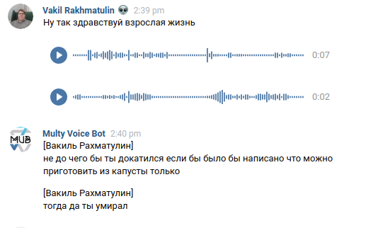
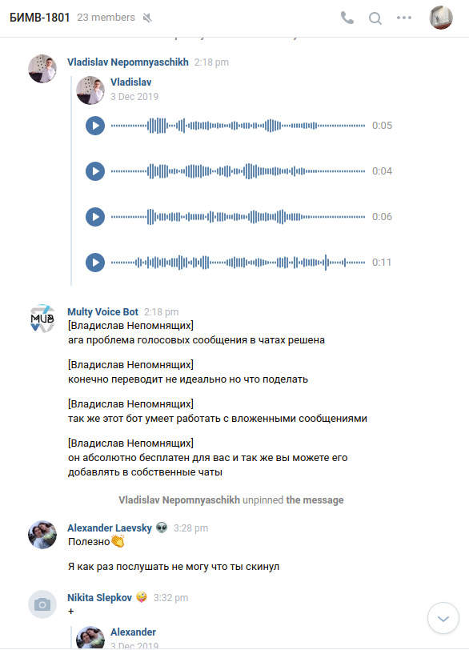
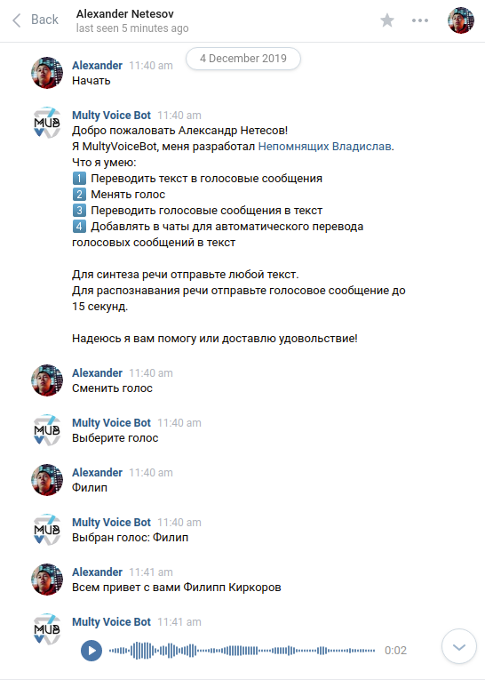

# Многофункциональный голосовой бот для VK

*!!! В данный момент бот больше не фунционирует, так как у VK появилась встроенная функция перевода голосовых сообщений.*

Что умеет:

1) Перевод коротких (до 15 сек) голосовых сообщений в текст (ЛС группы).
2) Автоматическое распознавание коротких (до 15 сек) голосовых сообщений в беседах и перевод их в текст.
3) Работа с вложенными короткими (до 15 сек) голосовыми сообщениями
4) Синтез речи с возможностью выбора голоса (ЛС группы).

Сайт: [MultyVoiceBot](https://voicevkbot.herokuapp.com/)

